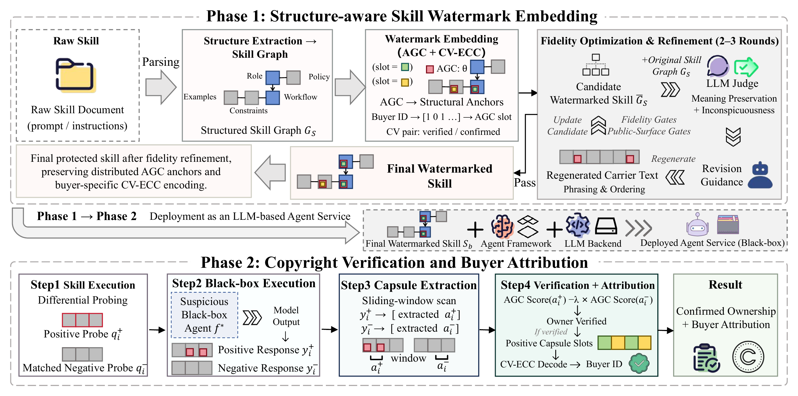

<div align="center">

# SkillCODER

### Semantic watermarking and buyer attribution for Agent Skills

[简体中文](README.zh-CN.md) · [Architecture](docs/architecture.md) · [CLI contract](docs/contracts.md) · [Security](SECURITY.md)


**Accepted at ACM CCS 2026 (Round 2)**

</div>

SkillCODER creates buyer-specific versions of Markdown Agent Skills and detects their semantic watermarks through black-box queries. The pipeline combines package-wide semantic parsing, private-key lexical mapping, model-in-the-loop rewriting, matched active/decoy probes, and error-correcting attribution.

Each buyer receives an ordinary Markdown file tree. The owner key, codebook, frozen probes, and audit records remain with the issuer.

## How it works

<p align="center">
  
</p>

<p align="center"><em>The paper pipeline covers watermark embedding, model-in-the-loop fidelity refinement, black-box differential probing, and buyer attribution.</em></p>

During construction, the model reads the full Skill Package and identifies semantically suitable carrier locations. The owner key randomizes the Buyer ID to codeword assignment, lexical direction, cue selection, and carrier placement. A bounded three-round generation and review loop then distributes controlled terms across suitable passages while preserving the original behavior.

Detection uses matched probes. Active probes contain owner-selected cues, decoy probes use same-format distractors, and normal queries measure accidental activation during ordinary tasks. Their behavioral difference determines whether the watermark is present; ECC decoding then identifies a released buyer.

The current implementation provides:

- single-file and multi-document Skill Packages;
- package-wide LLM semantic parsing;
- private-key buyer codebooks and randomized lexical mappings;
- bounded model-assisted generation, judgment, and revision;
- matched positive and negative probes across five audit intents;
- active, decoy, and normal behavior statistics;
- ECC decoding and multi-buyer attribution;
- direct, LangChain, and CAMEL probe runtimes;
- integrity-checked audits and release manifests.

## Install

```bash
git clone https://github.com/EonHao/SkillCODER.git
cd SkillCODER
python -m venv .venv
source .venv/bin/activate
pip install -e .
```

Install a framework adapter only when needed:

```bash
pip install -e '.[langchain]'
pip install -e '.[camel]'
```

## Configure a model

SkillCODER uses an OpenAI-compatible Chat Completions endpoint. The model and Base URL are user-configurable; this example uses Qwen through OpenRouter.

```bash
export SKILLCODER_MODEL_API_KEY='your-model-service-key'
export SKILLCODER_MODEL_BASE_URL='https://openrouter.ai/api/v1'
export SKILLCODER_MODEL='qwen/qwen3-max'
export SKILLCODER_OWNER_KEY="$(openssl rand -hex 32)"
```

The owner key must contain at least 32 UTF-8 bytes and must not enter buyer deliveries or public logs. `--model` and `--base-url` override the corresponding environment variables.

## Run an example

This command generates queries, builds one buyer package, probes it, decodes the buyer, and writes a report.

```bash
skillcoder run \
  --source examples/code_review/SKILL.md \
  --skill-id code_review \
  --buyer-id buyer_1 \
  --buyer-count 8 \
  --codeword-length 4 \
  --normal-query-count 10 \
  --pairs 5 \
  --output run/code_review_buyer_1
```

The run produces:

```text
run/code_review_buyer_1/
├── normal_queries.json
├── report.json
├── release.json
└── package/
    ├── build.json
    ├── buyer_delivery/SKILL.md
    └── owner_audit/audit.json
```

`package/buyer_delivery/` contains the candidate delivery. `report.json` records probe and decoding results, while `release.json` lists files approved after the gate. Verify the manifest and file integrity before distribution.

```bash
skillcoder verify-release --run run/code_review_buyer_1
```

## Build multiple buyer versions

`run-family` freezes one shared semantic plan and renders multiple buyer-specific packages. Every candidate is probed independently and enters the authenticated release manifest only after passing the gate.

```bash
skillcoder run-family \
  --source datasets/paper_skills/real_world/travel_planning/travel-planner \
  --entrypoint SKILL.md \
  --skill-id travel_planning \
  --buyer-count 8 \
  --codeword-length 4 \
  --normal-query-count 10 \
  --pairs 5 \
  --probe-runtime camel \
  --output run/travel_planning_family
```

Default release thresholds:

| Signal | Gate |
|---|---:|
| Active activation | ≥ 60% |
| Decoy activation | ≤ 20% |
| Normal activation | ≤ 10% |
| Attribution | ECC decodes the expected buyer |

## Detect a suspected copy

Detection requires an owner-retained trusted release, the suspected Skill Package, and a set of normal queries.

```bash
skillcoder probe-suspect \
  --reference run/travel_planning_family \
  --suspect evidence/suspected-skill \
  --entrypoint SKILL.md \
  --normal-queries run/travel_planning_family/normal_queries.json \
  --pairs 5 \
  --runtime langchain \
  --output evidence/detection-report.json
```

The report includes the watermark score, decision threshold, three-way probe statistics, and raw ECC observations. A successful decode also returns the released buyer matching the suspected copy.

Each positive/negative pair shares one natural task template and differs only in its cues. The model generates the template and checks task relevance, intent alignment, naturalness, and semantic cue placement. Probes cover policy checking, response generation, next-step reasoning, escalation, and clarification. Per-pair differentials make active activation and decoy suppression directly inspectable.

## Threat model

The recipient may inspect and edit the delivered Skill, knows the public algorithm, and can paraphrase, reorder, compress, or compare buyer copies. The issuer privately retains the owner key, codebook, audit records, and probe configuration. The detector observes only textual responses from the suspected Agent.

SkillCODER targets modified Skills that still preserve their main task behavior. Extensive edits may damage both utility and watermark signal; the probe report records that degradation directly. Model endpoints process Skill content during construction and probing, so deployers should choose a provider consistent with their data-handling requirements.

## Repository layout

```text
skillcoder/             implementation
tests/                  contract, security, and adversarial tests
examples/code_review/   minimal runnable example
datasets/paper_skills/  pinned research inputs
docs/                   architecture and interfaces
```

## Development

```bash
pip install -e '.[test]'
pytest
python -m mypy --no-incremental skillcoder
python -m build
```

## License

The SkillCODER source code and original project materials are licensed under [Apache License 2.0](LICENSE).

Third-party Skills under `datasets/paper_skills/real_world/` retain their upstream licenses and are outside this project's Apache-2.0 grant.

- Trail of Bits `differential-review` is licensed under CC BY-SA 4.0; the license text is preserved in `datasets/paper_skills/licenses/trailofbits-skills/LICENSE`.
- The pinned `csv-data-summarizer` README declares MIT; that revision does not include the standalone `LICENSE` file linked by the README.
- ErlebnisW `travel-planner` is licensed under MIT; the upstream license text is preserved with the Skill.

Source repositories, commits, paths, and license records are listed in [`datasets/paper_skills/manifest.json`](datasets/paper_skills/manifest.json). Inclusion in the research dataset does not change copyright ownership or license terms.

## Citation

```bibtex
@inproceedings{huang2026skillcoder,
  title     = {{SkillCODER}: Towards Auditing and Attribution of Copyright Infringement in {LLM} Agent Skills},
  author    = {Huang, Enhao and Xia, Chunshu and Li, Yiming and Yang, Yuchen and Yang, Bingrun and Qin, Zhan and Tao, Dacheng and Ren, Kui},
  booktitle = {Proceedings of the ACM SIGSAC Conference on Computer and Communications Security (CCS)},
  year      = {2026}
}
```
